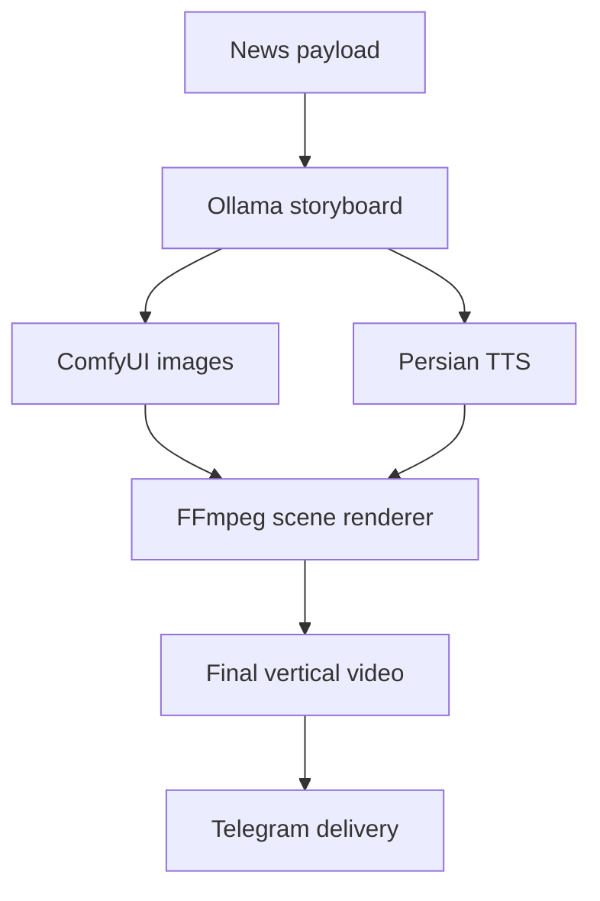

# News2Video AI

An end-to-end automation pipeline that turns a news story into a narrated,
subtitle-ready vertical video for social media. It combines local LLM
storyboarding, AI image generation, Persian text-to-speech, FFmpeg rendering,
and n8n orchestration.

This repository is a focused, reusable extraction of the video pipeline built
for **GermanNewsFA**, a system that translates and publishes German news for a
Persian-speaking audience.

## Highlights

- Generates a structured three-scene storyboard with a local Ollama model
- Creates vertical scene artwork through the ComfyUI API
- Produces Persian narration with Edge TTS
- Expands numbers and improves pronunciation of German names in Persian audio
- Burns Persian subtitles into 1080 × 1920 video scenes
- Adds zoom, fade, background music, intro, and outro with FFmpeg
- Orchestrates polling, validation, retries, delivery, and cleanup in n8n
- Runs without cloud AI for storyboarding and image generation

## Architecture



## Repository layout

```text
src/news2video_ai/
  tts.py             Persian TTS and pronunciation normalization
  video_engine.py    Scene rendering and final video composition
workflows/
  news2video_n8n_windows.json
examples/
  storyboard.json
tests/
assets/               Add your own intro, outro, music, and licensed fonts
```

## Requirements

- Python 3.10+
- FFmpeg and FFprobe available on `PATH`
- n8n 2.x for the included orchestration workflow
- Ollama at `http://127.0.0.1:11434`
- ComfyUI at `http://127.0.0.1:8188`

The supplied workflow is a Windows-oriented reference configuration. Its local
paths must be adjusted after import. n8n must allow the built-in Node.js modules
`fs` and `path` for its Code nodes.

## Quick start

```bash
git clone https://github.com/seyedali-saghaei/News2Video-AI.git
cd News2Video-AI
python -m venv .venv
```

Windows PowerShell:

```powershell
.venv\Scripts\Activate.ps1
pip install -e ".[dev]"
```

Linux or macOS:

```bash
source .venv/bin/activate
pip install -e '.[dev]'
```

If FFmpeg is not on `PATH`, copy `.env.example` to `.env` and set the binary
paths in your shell environment. The Python modules recognize `FFMPEG_PATH`,
`FFPROBE_PATH`, and `NEWS2VIDEO_FONTS_DIR`.

## Generate Persian narration

```bash
python -m news2video_ai.tts \
  --text "در سال 2026 این پروژه ساخته شد." \
  --output output/voice.mp3
```

For automation systems, UTF-8 text can be passed safely as Base64:

```bash
python -m news2video_ai.tts \
  --text-base64 "2K7bjNmGINmG2YXYp9uM2LTbjCDYp9iz2Ko=" \
  --output output/voice.mp3
```

## Render one scene

```bash
python -m news2video_ai.video_engine render-scene \
  --image output/scene_1.png \
  --audio output/scene_1_voice.mp3 \
  --output output/scene_1.mp4 \
  --subtitle-base64 "BASE64_UTF8_SUBTITLE" \
  --width 1080 --height 1920 --fps 30
```

## Finalize a video

```bash
python -m news2video_ai.video_engine finalize-video \
  --scenes output/scene_1.mp4 output/scene_2.mp4 output/scene_3.mp4 \
  --intro assets/intro.mp4 \
  --outro assets/outro.mp4 \
  --output output/final_video.mp4
```

## n8n workflow

Import `workflows/news2video_n8n_windows.json` into n8n, then:

1. replace the placeholder Windows paths with your installation paths;
2. select your Telegram credential in the delivery node;
3. confirm that Ollama and ComfyUI are reachable;
4. add licensed assets under `assets/`;
5. configure `NODE_FUNCTION_ALLOW_BUILTIN=fs,path` for self-hosted n8n.

No API keys or credential values are included in this repository.

## Docker

Build the rendering image:

```bash
docker build -t news2video-ai .
```

Mount input/output files when running it:

```bash
docker run --rm -v "$PWD:/work" news2video-ai \
  render-scene --image /work/input.png --audio /work/voice.mp3 \
  --output /work/output.mp4 --subtitle-base64 "BASE64_UTF8_SUBTITLE"
```

## Tests

```bash
pytest
```

## Git workflow

Create focused commits with an imperative message and review the staged files
before each commit:

```bash
git status
git diff --staged
git add <files>
git commit -m "Add Persian TTS normalization"
```

For the first push of this repository:

```bash
git branch -M main
git remote add origin https://github.com/seyedali-saghaei/News2Video-AI.git
git push -u origin main
```

For later updates:

```bash
git pull --rebase origin main
git push
```

Never commit `.env`, credentials, generated videos, local model files, or
execution folders. Do not rewrite commit dates to make a project appear older;
small, meaningful commits are more credible than artificial activity.

## Privacy and assets

Generated media, `.env` files, credentials, and local execution folders are
excluded from Git. Intro/outro footage, music, model checkpoints, and fonts are
not distributed; use only assets whose licenses permit publication.

## License

MIT License — see [LICENSE](LICENSE).
